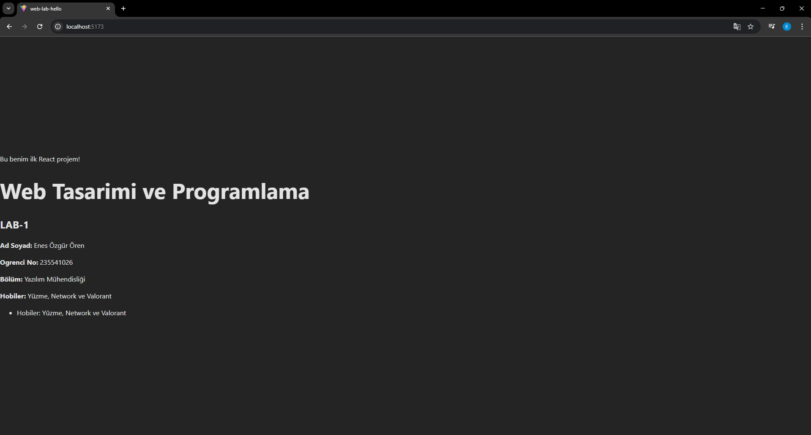

# Web Tasarımı ve Programlama - Lab 1

Bu proje, Vite + React ve TypeScript kullanılarak oluşturulmuş ilk laboratuvar uygulamasıdır.

## Proje İçeriği
- Kişisel bilgiler ve hobiler sayfası.
- Git ve GitHub üzerinde branch (dal) yönetimi.
- TypeScript ile bileşen (component) yapısı.

## Öğrenci Bilgileri
- **Ad Soyad:** Enes Özgür Ören
- **Numara:** 235541026
- **Bölüm:** Yazılım Mühendisliği

# Web LAB-1 - Hello Project

## Hakkinda
Bu proje, Web Tasarimi ve Programlama dersi LAB-1 kapsaminda Vite + React + TypeScript kullanilarak olusturulmustur.

## Gelistirici
- **Ad Soyad:** Enes Özgür Ören
- **Ogrenci No:** 235541026

## Kullanilan Teknolojiler
- React 18
- TypeScript
- Vite

## Kurulum
```bash
npm install


